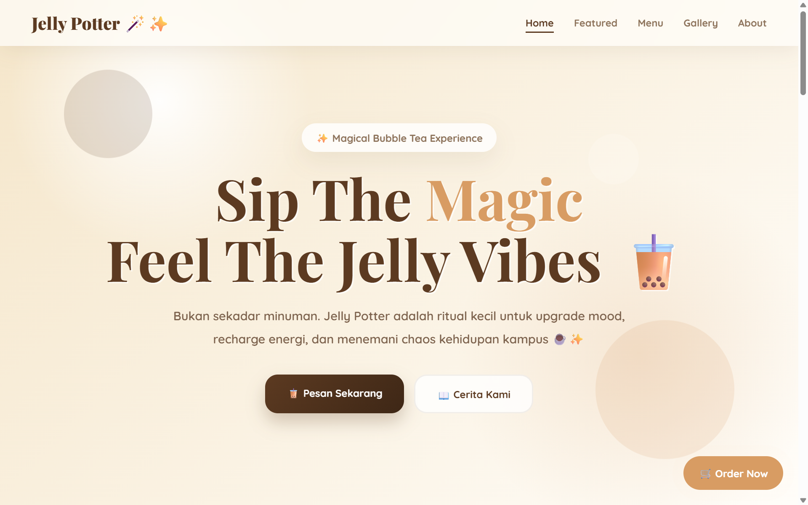
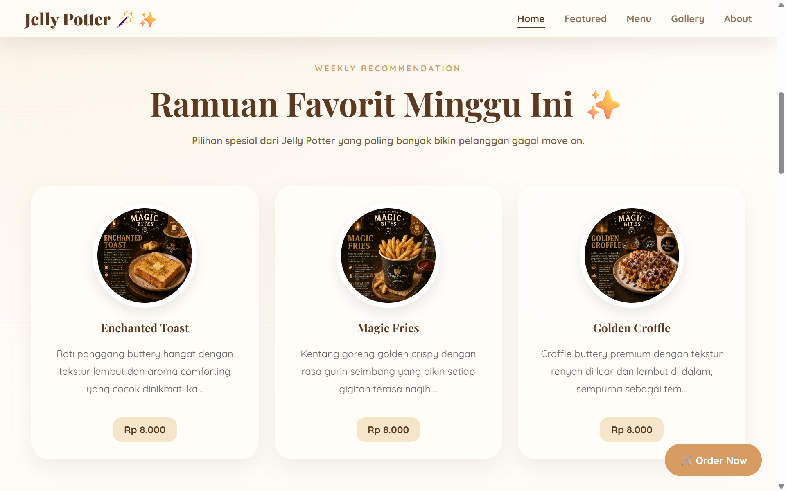
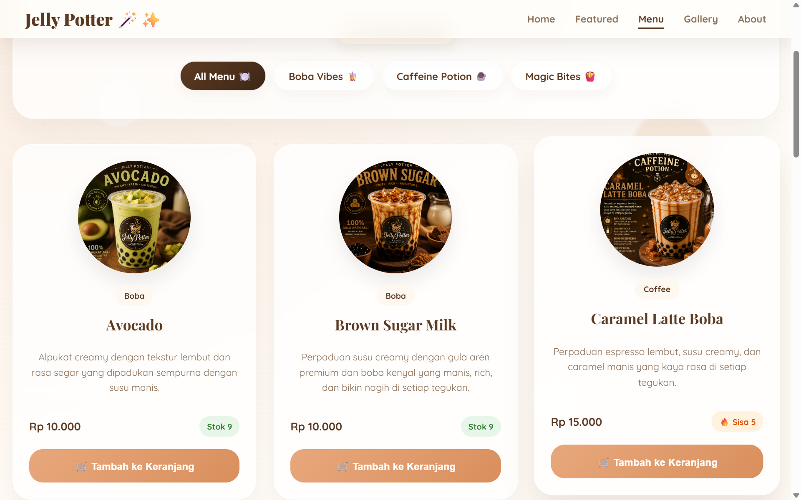
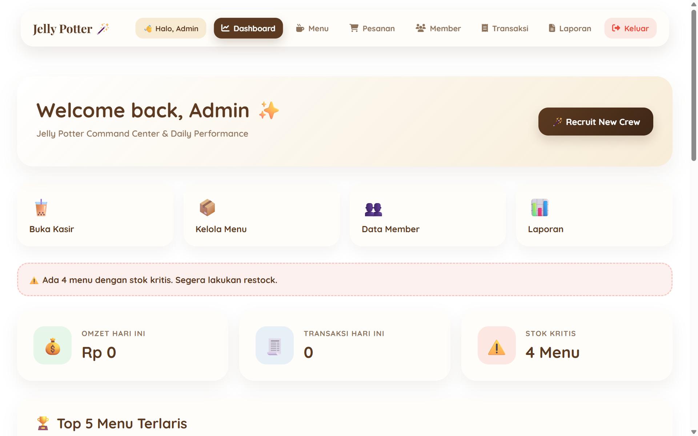
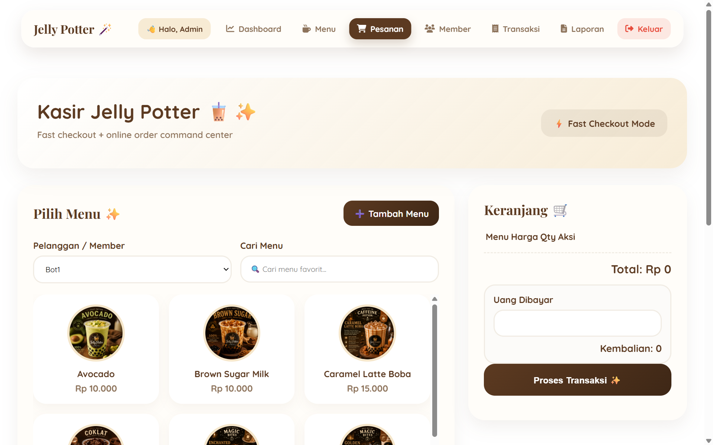
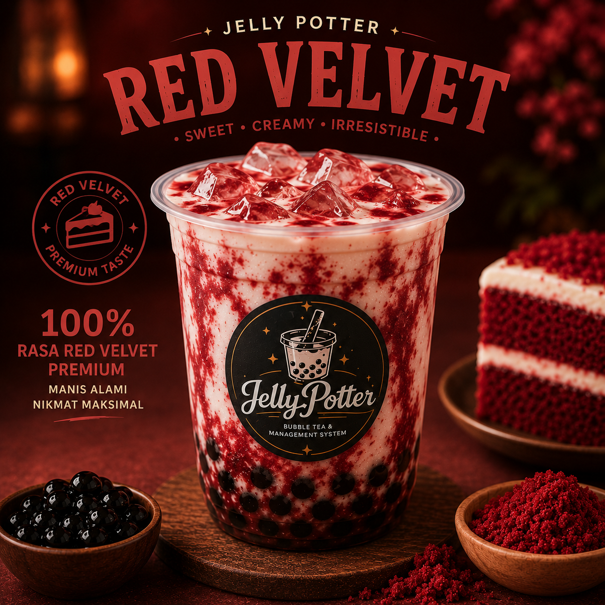

# 🍹 Jelly Potter - Point of Sale (POS) System

A Web-based Point of Sale and Ordering Management System for Jelly Potter beverage franchise, built with native PHP, MySQL, and AJAX.

[](http://jellypotter.infinityfreeapp.com/)
[](https://github.com/Virnara/jellypotter)


---

## 📸 Project Preview

<div align="center">
  <div style="display: flex; overflow-x: auto; gap: 12px; padding-bottom: 10px;">
    
    
    
    
    
  </div>
  <p><sub>↔️ <i>Geser ke kanan/kiri untuk melihat seluruh antarmuka aplikasi</i></sub></p>
</div>

### Customer Ordering & Menu Catalog


### Dashboard Management
*(Unggah screenshot dashboard Anda di sini dan simpan di folder assets/images/dashboard.png)*

---

## ✨ Overview
**Jelly Potter POS System** is a dynamic web application designed to streamline order taking, cart management, and sales monitoring for beverage outlets.

Built with native PHP and MySQL, the application enables interactive item additions without page reloads using AJAX, manages real-time order processing, and provides an administrative dashboard for monitoring business operations. The application is production-deployed on cloud hosting with remote database mapping.

---

## 🎯 Objectives
This project aims to:
- Provide an intuitive digital menu catalog featuring diverse beverage options (Red Velvet, Taro, etc.).
- Enable asynchronous cart management (add, update, delete items) for seamless customer interaction.
- Centralize transactional data and order processing into a structured MySQL database.
- Present a dedicated admin dashboard for order tracking and inventory management.

---

## 🚀 Features
- **Interactive Menu Catalog:** Grid display of available drinks with responsive imagery and detailed pricing.
- **Asynchronous Cart Management:** Dynamic item insertion using `ajax_tambah_keranjang.php` without refreshing the browser.
- **Order Fetching & State Tracking:** Automated order retrieval (`fetch_pesanan.php`) for operational processing.
- **CRUD Operations:** Complete data manipulation routines for updating menu items, managing orders, and deleting invalid entries (`edit.php`, `hapus.php`).
- **Live Cloud Deployment:** Fully hosted on cloud infrastructure with custom database connections.

---

## 🛠 Tech Stack Matrix

| Category | Technology / Tool | Specification / Usage |
| :--- | :--- | :--- |
| **Backend** | PHP (Native) | Core server-side business logic and endpoint handling |
| **Database** | MySQL | Relational database engine for menu items and orders |
| **Frontend** | HTML5, CSS3, JavaScript | User interface structure, styling, and client routines |
| **Asynchronous Engine** | AJAX (Fetch/jQuery) | Background request handling without page reloads |
| **Web Server / Hosting** | InfinityFree (Apache/Nginx) | Cloud server deployment platform |
| **Development IDE** | Visual Studio Code | Code development environment |

---

## 📂 Project Structure
```text
jellypotter/
├── .vscode/
│   └── settings.json
├── img/
│   ├── 064411_red_velvet.png
│   └── 064422_taro.png
├── ajax_tambah_keranjang.php
├── dashboard.php
├── detail.php
├── edit.php
├── fetch_pesanan.php
├── hapus.php
├── koneksi.php
└── README.md

```

---

## ⚙️ Database Configuration & Setup

### 1. Database Schema (`jelly_db`)

Ensure your MySQL environment includes the required relational tables for menu items and sales transactions.

### 2. Local Connection (`koneksi.php`)

For local execution using XAMPP/WAMP, configure your database connection driver:

```php
<?php
$host = "localhost";
$user = "root";
$pass = "";
$db   = "jelly_db";

$conn = mysqli_connect($host, $user, $pass, $db);

if (!$conn) {
    die("Koneksi gagal: " . mysqli_connect_error());
}
?>

```

---

## 🛠️ Installation & Setup

### 1. Repository Cloning

```bash
git clone [https://github.com/Virnara/jellypotter.git](https://github.com/Virnara/jellypotter.git)
cd jellypotter

```

### 2. Local Deployment (XAMPP)

1. Move the `jellypotter` directory into your local web server root (`C:/xampp/htdocs/jellypotter`).
2. Open **phpMyAdmin** (`http://localhost/phpmyadmin`) and create a database named `jelly_db`.
3. Import your project `.sql` file into `jelly_db`.
4. Configure `koneksi.php` with your local database credentials.
5. Access the application in your browser at `http://localhost/jellypotter/dashboard.php`.

---

## 🌐 Live Web Demo

The application is deployed live on cloud hosting and accessible online:

👉 **[Access Live Demo Here](http://jellypotter.infinityfreeapp.com/)**

---

## 🛣️ Roadmap & Future Enhancements

* [x] Responsive digital catalog and item detail views.
* [x] Asynchronous AJAX cart additions.
* [x] Relational MySQL database structure for orders and inventory.
* [ ] Role-based access control (RBAC) for Admin and Cashier logins.
* [ ] PDF receipt generation for completed customer transactions.
* [ ] Financial report analytics with visual charts (Chart.js).

---

## 👨‍💻 Author

**Radel Virdiana**
*Web Developer • IoT Developer*

Building practical, modern digital solutions combining software systems and embedded hardware technology.

* 🌐 **Portfolio:** [virnara.github.io](https://virnara.github.io)
* 🐙 **GitHub:** [@Virnara](https://github.com/Virnara)
* 📺 **YouTube:** [@Virnara](https://youtube.com/@Virnara)

---

## 📄 License

This project is open-source and available under the [MIT License](https://www.google.com/search?q=LICENSE).

```

```
